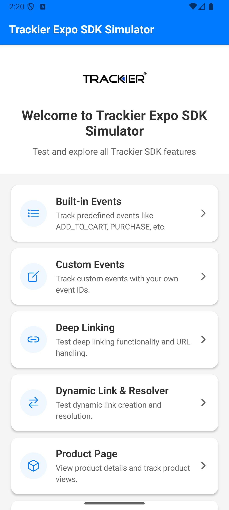
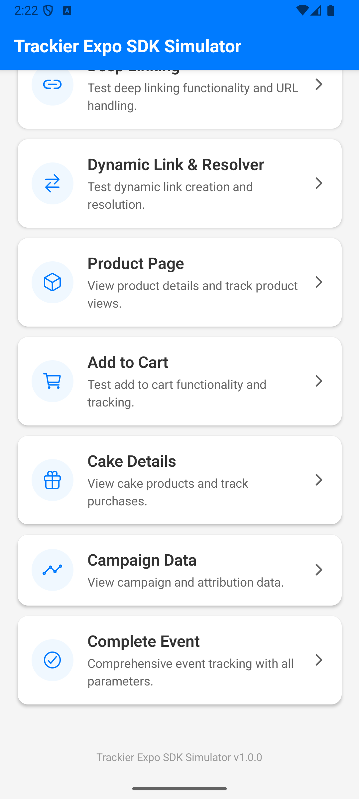
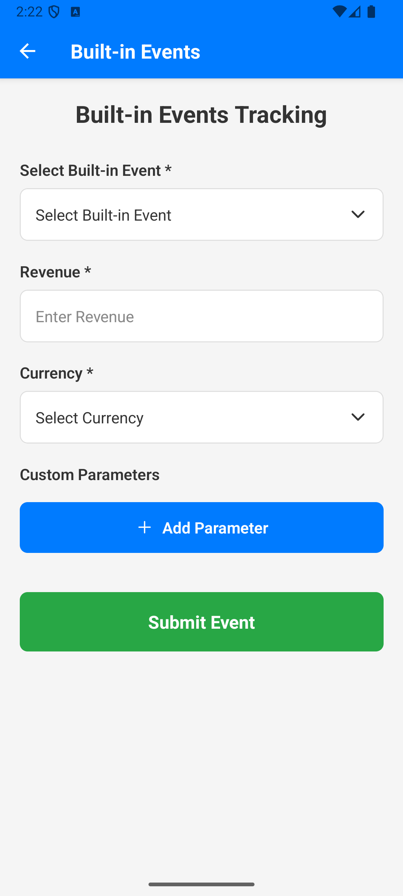
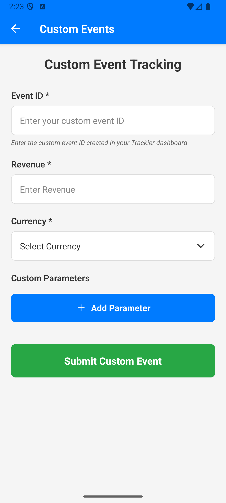
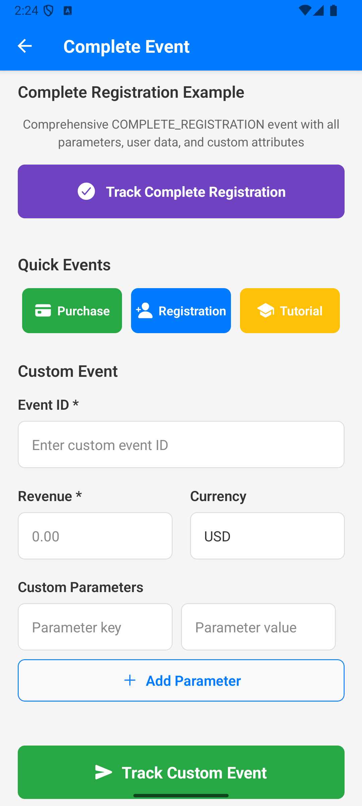
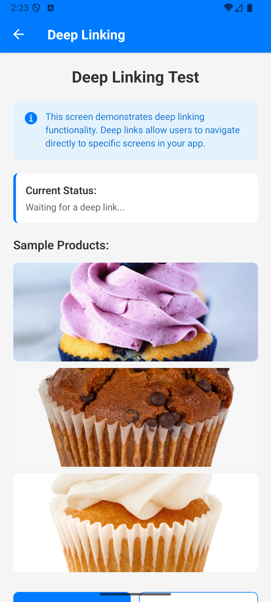
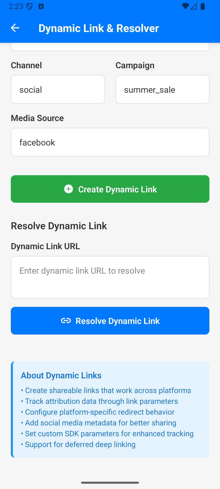
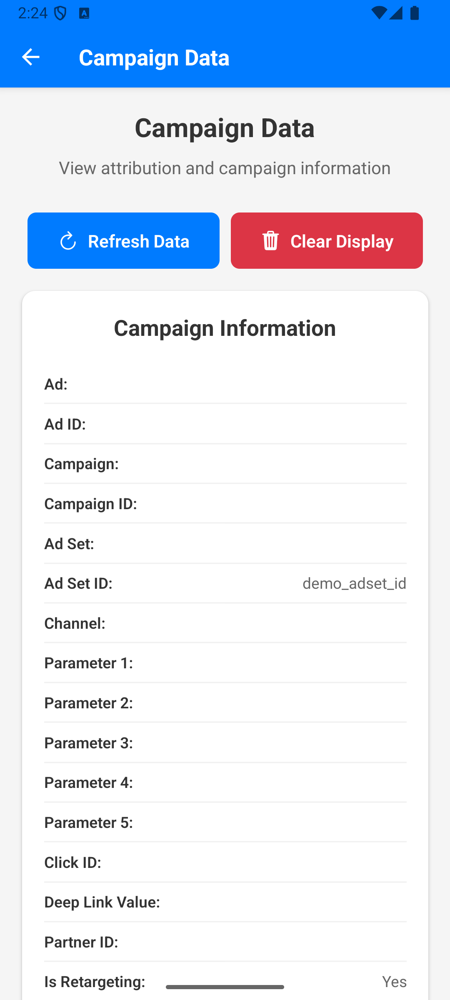
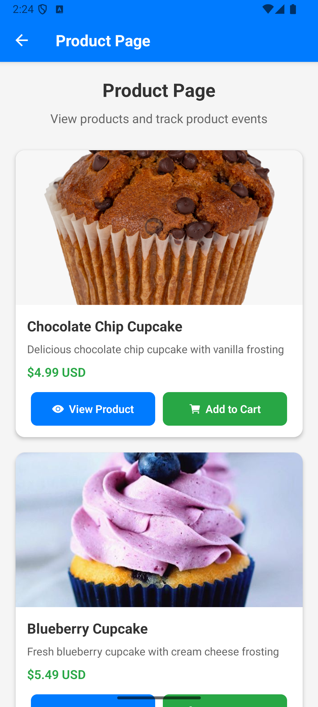
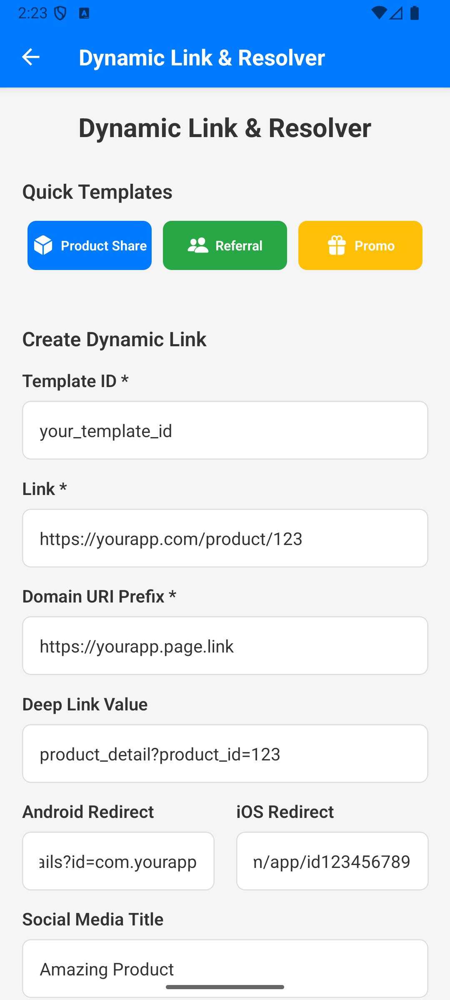

# AppTrove Expo SDK Simulator

A comprehensive React Native Expo application demonstrating the complete implementation of Trackier SDK with all features including event tracking, deep linking, Apple Ads Token, uninstall tracking, and more.

**Official Documentation:** [AppTrove Expo SDK Documentation](https://developers.apptrove.com/docs/expo-sdk/intro)

## App Overview

This simulator app showcases the full capabilities of the Trackier Expo SDK, providing a complete testing environment for mobile app attribution and analytics.

**Bundle Identifier:** `com.anonymous.exposdksimulator`

## Features Implemented

### 1. Trackier SDK Core Features
- SDK Initialization with Configuration
- Event Tracking (Built-in & Custom Events)
- Deep Link Handling
- Deferred Deep Link Support
- User Data Management
- Campaign Data Tracking

### 2. Platform-Specific Features
- **iOS**: Apple Ads Token (IDFA) with App Tracking Transparency
- **Android**: Uninstall Tracking with Firebase Analytics
- **Cross-Platform**: Google Advertising ID Support

### 3. Advanced Features
- Facebook App ID Integration
- Custom Android ID Support
- Encryption (AES_GCM)
- ProGuard Rules for Android
- Comprehensive Event Parameters

## Project Structure

```
expo-sdk-simulator/
├── App.js                          # Main app with SDK initialization
├── screens/
│   ├── HomeScreen.js               # Main dashboard with navigation
│   ├── BuiltInEventsScreen.js      # Built-in event tracking (15 events)
│   ├── CustomEventsScreen.js       # Custom event tracking with parameters
│   ├── CompleteEventScreen.js      # Comprehensive event example with all features
│   ├── DeepLinkingScreen.js        # Deep link handling and parsing
│   ├── DynamicLinkScreen.js        # Dynamic link resolver and creator
│   ├── ProductPageScreen.js        # Product page with view tracking
│   ├── AddToCartScreen.js          # Add to cart events
│   ├── CakeScreen.js               # Product details with purchase tracking
│   └── CampaignDataScreen.js       # Campaign data management and display
├── assets/
│   └── Images/                     # App screenshots (400x400)
├── android/                        # Android configuration
│   ├── app/build.gradle            # Dependencies and build config
│   ├── app/src/main/AndroidManifest.xml # Permissions and deep links
│   ├── app/proguard-rules.pro      # ProGuard rules for obfuscation
│   └── gradle.properties           # Node.js path configuration
└── ios/                           # iOS configuration
    └── exposdksimulator/Info.plist # ATT permission and app config
```

## File Details

### Core Files
- **App.js**: Main application file with Trackier SDK initialization, deep link handling, Apple Ads Token setup, and uninstall tracking
- **package.json**: Dependencies including trackier-expo-sdk and react-native-tracking-transparency

### Screen Files
- **HomeScreen.js**: Main dashboard with navigation to all features
- **BuiltInEventsScreen.js**: Implements 15 built-in events with parameter support
- **CustomEventsScreen.js**: Custom event tracking with dynamic parameters
- **CompleteEventScreen.js**: Comprehensive example with all event features
- **DeepLinkingScreen.js**: Deep link parsing and navigation handling
- **DynamicLinkScreen.js**: Dynamic link resolution and creation
- **ProductPageScreen.js**: Product view tracking implementation
- **AddToCartScreen.js**: Add to cart event tracking
- **CakeScreen.js**: Product details with purchase and view tracking
- **CampaignDataScreen.js**: Campaign data retrieval and display

### Configuration Files
- **android/app/build.gradle**: Google Play Services dependencies
- **android/app/src/main/AndroidManifest.xml**: Permissions and deep link configuration
- **android/app/proguard-rules.pro**: ProGuard rules for Trackier SDK
- **ios/exposdksimulator/Info.plist**: App Tracking Transparency permission

## SDK Configuration

### App.js - Main Configuration

```javascript
// Trackier SDK Configuration
const trackierConfig = new TrackierConfig(
  "XXXXXXXX-XXXX-XXXX-XXXX-XXXXXXXXXXXX", // App Token
  TrackierConfig.EnvironmentDevelopment
);

// App Secret for SDK signing
trackierConfig.setAppSecret(
  "XXXXXXXXXXXXXXXXXXXXXXXX", // Secret ID
  "XXXXXXXX-XXXX-XXXX-XXXX-XXXXXXXXXXXX" // Secret Key
);

// App ID
trackierConfig.setAppId("XXXXXXXXXX");

// Encryption
trackierConfig.setEncryptionKey("XXXXXXXXXXXXXXXXXXXXXXXXXXXXXXXXXXXXXXXX");
trackierConfig.setEncryptionType(TrackierConfig.EncryptionType.AES_GCM);

// Facebook App ID for Meta attribution
trackierConfig.setFacebookAppId("XXXXXXXXXXXXXXX");

// Custom Android ID
trackierConfig.setAndroidId("custom_android_device_id_123");
```

## Screenshots

### Main Screens

<div style="display: flex; flex-wrap: wrap; gap: 20px; margin: 20px 0;">
  <div style="flex: 1; min-width: 400px;">
    
    <p style="text-align: center; margin-top: 10px; font-weight: bold;">Home Screen - Main Dashboard</p>
  </div>
  <div style="flex: 1; min-width: 400px;">
    
    <p style="text-align: center; margin-top: 10px; font-weight: bold;">Home Screen - Feature Overview</p>
  </div>
</div>

### Event Tracking Screens

<div style="display: flex; flex-wrap: wrap; gap: 20px; margin: 20px 0;">
  <div style="flex: 1; min-width: 400px;">
    
    <p style="text-align: center; margin-top: 10px; font-weight: bold;">Built-in Events Screen</p>
  </div>
  <div style="flex: 1; min-width: 400px;">
    
    <p style="text-align: center; margin-top: 10px; font-weight: bold;">Custom Events Screen</p>
  </div>
</div>

### Advanced Features

<div style="display: flex; flex-wrap: wrap; gap: 20px; margin: 20px 0;">
  <div style="flex: 1; min-width: 400px;">
    
    <p style="text-align: center; margin-top: 10px; font-weight: bold;">Complete Event Screen</p>
  </div>
  <div style="flex: 1; min-width: 400px;">
    
    <p style="text-align: center; margin-top: 10px; font-weight: bold;">Deep Link Screen</p>
  </div>
</div>

### Dynamic Links & Campaign Data

<div style="display: flex; flex-wrap: wrap; gap: 20px; margin: 20px 0;">
  <div style="flex: 1; min-width: 400px;">
    
    <p style="text-align: center; margin-top: 10px; font-weight: bold;">Dynamic Link Resolver</p>
  </div>
  <div style="flex: 1; min-width: 400px;">
    
    <p style="text-align: center; margin-top: 10px; font-weight: bold;">Campaign Data Screen</p>
  </div>
</div>

### Product & Dynamic Link Fields

<div style="display: flex; flex-wrap: wrap; gap: 20px; margin: 20px 0;">
  <div style="flex: 1; min-width: 400px;">
    
    <p style="text-align: center; margin-top: 10px; font-weight: bold;">Product Page Screen</p>
  </div>
  <div style="flex: 1; min-width: 400px;">
    
    <p style="text-align: center; margin-top: 10px; font-weight: bold;">Dynamic Link Fields</p>
  </div>
</div>

## Implementation Details

### 1. **SDK Initialization** (`App.js`)

```javascript
const initializeTrackierSDK = async () => {
  const trackierConfig = new TrackierConfig(
    "XXXXXXXX-XXXX-XXXX-XXXX-XXXXXXXXXXXX",
    TrackierConfig.EnvironmentDevelopment
  );
  
  // Configure all settings
  trackierConfig.setAppSecret("XXXXXXXXXXXXXXXXXXXXXXXX", "XXXXXXXX-XXXX-XXXX-XXXX-XXXXXXXXXXXX");
  trackierConfig.setAppId("XXXXXXXXXX");
  trackierConfig.setEncryptionKey("XXXXXXXXXXXXXXXXXXXXXXXXXXXXXXXXXXXXXXXX");
  trackierConfig.setEncryptionType(TrackierConfig.EncryptionType.AES_GCM);
  trackierConfig.setFacebookAppId("XXXXXXXXXXXXXXX");
  trackierConfig.setAndroidId("CUSTOM_ANDROID_ID");
  
  // Initialize SDK
  TrackierSDK.initialize(trackierConfig);
};
```

### 2. **Apple Ads Token (iOS)** (`App.js`)

```javascript
const setupAppleAdsToken = async () => {
  if (Platform.OS !== 'ios') return;
  
  try {
    const { requestTrackingPermission, getAdvertisingId } = require('react-native-tracking-transparency');
    
    const permissionStatus = await requestTrackingPermission();
    
    if (permissionStatus === 'authorized') {
      const advertisingId = await getAdvertisingId();
      if (advertisingId && TrackierSDK.updateAppleAdsToken) {
        TrackierSDK.updateAppleAdsToken(advertisingId);
      }
    }
  } catch (error) {
    console.warn("Apple Ads Token setup failed:", error);
  }
};
```

iOS Configuration Required:
- NSUserTrackingUsageDescription in Info.plist
- react-native-tracking-transparency package

### 3. **Uninstall Tracking (Android)** (`App.js`)

```javascript
const setupUninstallTracking = async () => {
  if (Platform.OS !== 'android') return;
  
  try {
    const trackierId = await TrackierSDK.getTrackierId();
    console.log("Trackier ID for uninstall tracking:", trackierId);
    
    // For production, integrate with your preferred analytics platform
    // Example: await analytics().setUserProperty('ct_objectId', trackierId);
  } catch (error) {
    console.log("Error setting up uninstall tracking:", error);
  }
};
```

### 4. **Deep Link Handling** (`App.js`)

```javascript
const handleDeepLink = (url) => {
  try {
    let parsedUrl = new URL(url);
    let productId = parsedUrl.searchParams.get('product_id');
    let quantity = parsedUrl.searchParams.get('quantity');
    // ... parse other parameters
    
    // Navigate based on deep link
    if (parsedUrl.pathname === '/d') {
      navigationRef.current?.navigate('CakeScreen', {
        productId, quantity, // ... other params
      });
    }
  } catch (error) {
    console.error("Error parsing deep link:", error);
  }
};
```

### 5. **Complete Event Tracking** (`CompleteEventScreen.js`)

```javascript
const handleCompleteRegistrationExample = () => {
  const event = new TrackierEvent(TrackierEvent.COMPLETE_REGISTRATION);
  
  // Built-in fields
  event.orderId = "REG_001";
  event.currency = "USD";
  event.couponCode = "WELCOME10";
  event.discount = 5.0;
  event.revenue = 0.0;
  
  // Custom parameters
  event.param1 = "Test1";
  event.param2 = "Test2";
  // ... param3 to param10
  
  // Custom key-value pairs
  event.setEventValue("signup_time", Date.now());
  event.setEventValue("sdk", "ExpoNative");
  
  // Custom data object
  event.ev = {
    signup_time: Date.now(),
    device: "Expo-ReactNative",
    referral: "Campaign_XYZ",
  };
  
  // User data
  TrackierSDK.setUserId("USER12345");
  TrackierSDK.setUserEmail("user@example.com");
  TrackierSDK.setUserName("Jane Doe");
  TrackierSDK.setUserPhone("+1234567890");
  TrackierSDK.setIMEI("123456789012345", "987654321098765");
  TrackierSDK.setMacAddress("00:1A:2B:3C:4D:5E");
  
  // Additional user details
  const jsonData = {"phone": "+91-8137872378", "name": "Embassies"};
  TrackierSDK.setUserAdditionalDetails("data", jsonData);
  
  // Track the event
  TrackierSDK.trackEvent(event);
};
```

## Platform Configuration

### Android Configuration

#### `android/app/build.gradle`
```gradle
dependencies {
    // Google Play Services Ads Identifier
    implementation 'com.google.android.gms:play-services-ads-identifier:18.0.1'
    // Google Play Install Referrer
    implementation 'com.android.installreferrer:installreferrer:2.2'
}
```

#### `android/app/src/main/AndroidManifest.xml`
```xml
<uses-permission android:name="com.google.android.gms.permission.AD_ID"/>

<application>
    <meta-data
        android:name="com.google.android.gms.version"
        android:value="@integer/google_play_services_version" />
        
    <!-- Deep Link Configuration -->
    <activity android:name=".MainActivity">
        <intent-filter>
            <action android:name="android.intent.action.VIEW"/>
            <category android:name="android.intent.category.DEFAULT"/>
            <category android:name="android.intent.category.BROWSABLE"/>
            <data
                android:host="trackier58.u9ilnk.me"
                android:pathPrefix="/d"
                android:scheme="https" />
        </intent-filter>
    </activity>
</application>
```

#### `android/app/proguard-rules.pro`
```proguard
# Trackier SDK ProGuard rules
-keep class com.trackier.sdk.** { *; }

# Google Play Services ProGuard rules
-keep class com.google.android.gms.common.ConnectionResult {
    int SUCCESS;
}
-keep class com.google.android.gms.ads.identifier.AdvertisingIdClient {
    com.google.android.gms.ads.identifier.AdvertisingIdClient$Info getAdvertisingIdInfo(android.content.Context);
}
-keep class com.google.android.gms.ads.identifier.AdvertisingIdClient$Info {
    java.lang.String getId();
    boolean isLimitAdTrackingEnabled();
}
-keep public class com.android.installreferrer.** { *; }
```

### iOS Configuration

#### `ios/exposdksimulator/Info.plist`
```xml
<key>NSUserTrackingUsageDescription</key>
<string>This app would like to track you across apps and websites owned by other companies to provide personalized ads and improve our services.</string>
```

## Dependencies

### `package.json`
```json
{
  "dependencies": {
    "trackier-expo-sdk": "^1.6.76",
    "react-native-tracking-transparency": "^0.1.2",
    "@react-navigation/native": "^6.1.9",
    "@react-navigation/native-stack": "^6.9.17",
    "expo": "~54.0.7",
    "expo-linking": "~8.0.8",
    "react-native-paper": "^5.12.5"
  }
}
```

## Getting Started

### Prerequisites
- Node.js 18+
- Expo CLI
- iOS Simulator (for iOS testing)
- Android Studio (for Android testing)

### Installation

1. **Clone the repository**
```bash
git clone <repository-url>
cd expo-sdk-simulator
```

2. **Install dependencies**
```bash
npm install
```

3. **Configure Trackier SDK**
   - Update `App.js` with your Trackier credentials
   - Replace app token, secret ID, secret key, and app ID

4. **Run the app**
```bash
# iOS
npx expo run:ios

# Android
npx expo run:android

# Development server
npx expo start
```

## Testing Features

### 1. **Event Tracking**
- Navigate to "Built-in Events" to test standard events
- Use "Custom Events" for custom event tracking
- Try "Complete Event" for comprehensive event example

### 2. **Deep Links**
- Test deep link handling in "Deep Linking" screen
- Use "Dynamic Link Resolver" for dynamic link testing

### 3. **Apple Ads Token (iOS)**
- Launch on iOS simulator
- Check console logs for ATT permission flow
- Verify IDFA retrieval and sending to Trackier

### 4. **Uninstall Tracking (Android)**
- Launch on Android device/emulator
- Check console logs for Trackier ID
- Verify manual tracking setup

## Trackier SDK Methods Implemented

### Core SDK Methods
- `TrackierSDK.initialize()` - Initialize SDK with configuration
- `TrackierSDK.trackEvent()` - Track events (built-in and custom)
- `TrackierSDK.parseDeepLink()` - Parse and handle deep links
- `TrackierSDK.getTrackierId()` - Get unique Trackier ID
- `TrackierSDK.updateAppleAdsToken()` - Update Apple Ads Token (iOS)

### User Data Methods
- `TrackierSDK.setUserId()` - Set user ID
- `TrackierSDK.setUserEmail()` - Set user email
- `TrackierSDK.setUserName()` - Set user name
- `TrackierSDK.setUserPhone()` - Set user phone
- `TrackierSDK.setIMEI()` - Set IMEI (Android)
- `TrackierSDK.setMacAddress()` - Set MAC address
- `TrackierSDK.setUserAdditionalDetails()` - Set additional user data

### Campaign Data Methods
- `TrackierSDK.getAd()` - Get ad information
- `TrackierSDK.getAdID()` - Get ad ID
- `TrackierSDK.getCampaign()` - Get campaign name
- `TrackierSDK.getCampaignID()` - Get campaign ID
- `TrackierSDK.getAdSet()` - Get ad set name
- `TrackierSDK.getAdSetID()` - Get ad set ID
- `TrackierSDK.getChannel()` - Get channel information
- `TrackierSDK.getP1()` to `TrackierSDK.getP5()` - Get custom parameters
- `TrackierSDK.getClickId()` - Get click ID
- `TrackierSDK.getDlv()` - Get deep link value
- `TrackierSDK.getPid()` - Get partner ID
- `TrackierSDK.getIsRetargeting()` - Get retargeting status

### Dynamic Link Methods
- `TrackierSDK.resolveDeeplinkUrl()` - Resolve deep link URL
- `TrackierSDK.createDynamicLink()` - Create dynamic link

### Configuration Methods
- `TrackierConfig.setAppSecret()` - Set app secret
- `TrackierConfig.setAppId()` - Set app ID
- `TrackierConfig.setEncryptionKey()` - Set encryption key
- `TrackierConfig.setEncryptionType()` - Set encryption type
- `TrackierConfig.setFacebookAppId()` - Set Facebook App ID
- `TrackierConfig.setAndroidId()` - Set custom Android ID
- `TrackierConfig.setDeferredDeeplinkCallbackListener()` - Set deferred deep link callback

## Event Types Supported

### Built-in Events
- `ADD_TO_CART` - Add to cart events
- `LEVEL_ACHIEVED` - Level achievement events
- `ADD_TO_WISHLIST` - Add to wishlist events
- `COMPLETE_REGISTRATION` - User registration
- `TUTORIAL_COMPLETION` - Tutorial completion
- `PURCHASE` - Purchase events
- `SUBSCRIBE` - Subscription events
- `START_TRIAL` - Trial start events
- `ACHIEVEMENT_UNLOCKED` - Achievement events
- `CONTENT_VIEW` - Content view events
- `TRAVEL_BOOKING` - Travel booking events
- `SHARE` - Share events
- `INVITE` - Invite events
- `LOGIN` - Login events
- `UPDATE` - Update events

### Custom Events
- Any custom event ID
- Full parameter support (param1-param10)
- Custom key-value pairs with `setEventValue()`
- Custom data object (ev map)
- Revenue and currency tracking
- Order ID and coupon code support

## Debugging

### Console Logs
The app provides comprehensive logging for:
- SDK initialization status
- Event tracking confirmations
- Deep link parsing
- Apple Ads Token flow
- Uninstall tracking setup

### Common Issues
1. **Firebase Analytics Error**: Expected in Expo Go, handled gracefully
2. **ATT Permission**: Requires iOS 14.5+ and proper Info.plist configuration
3. **Deep Link Parsing**: Robust error handling for malformed URLs

## Platform Support

- ✅ **iOS**: Full support with ATT integration
- ✅ **Android**: Full support with Google Play Services
- ✅ **Expo Go**: Compatible with development client
- ✅ **Production**: Ready for App Store/Play Store deployment

## Security Features

- AES_GCM encryption for data transmission
- App secret signing for SDK authentication
- ProGuard rules for Android code obfuscation
- Secure deep link handling with validation

## Analytics Integration

### Trackier Dashboard
- Real-time event tracking
- User attribution data
- Campaign performance metrics
- Deep link analytics

### Custom Analytics
- Manual uninstall tracking setup
- Custom event parameters
- User data management
- Revenue tracking

## Support

For Trackier SDK support:
- [Trackier Documentation](https://docs.trackier.com)
- [Trackier Support](https://support.trackier.com)

## License

This project is for demonstration purposes. Please refer to Trackier's terms of service for production use.

---

**Built with React Native, Expo, and Trackier SDK**
